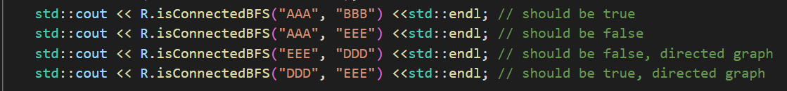

# CS 225 Final Project Report Fall 2022 
Contributors: Hanpu Liu, Jake Cheng, Peter, Dekai.

## Overview

Our project uses the openflights data set from https://openflights.org/data.html to perform two main algorithms: Dijkstra and Page Rank. We first appended the airports dataset to include the flight distance at the last column. With that, we created a graph using adjacency list and implemented Breadth First Search to check if airports are connected. 

## Breadth-First Search
We chose to use BFS to traverse each of the airport to find whether two airports are connected and wrote certain test cases to test whether this function work
The file testroutes.dat is used as a make-shift test data to test whether two airports are connected. In this dataset, we provided five airports, AAA, BBB, CCC, DDD, EEE as shown below. The first three are connected, and the last two are connected. We test to find the shortest Path between AAA and DDD, which means the outputs should be false.

 

Full Scale Run with the actual data: 
SIN to DPS: connected

## Dijkstra
The Dijkstra Algorithm is chosen to find the shortest path between 2 airports and returns a pair of <shortestDistance, vector of intermediate airports>. To do this, we first use a priority queue to update the shortest distance and while doing it, we use a backtracking algorithm to store the previous airports.
 
First, we test it with our own test cases with this graph:
 

 
The first test case is testing the path from DDD to AAA. The actual output should be DDD CCC EEE AAA  
The second test case is testing the path from BBB to AAA. The actual output should be BBB CCC AAA  

## Page Rank
The Page Rank Algorithm is chosen to find a vector containing first n popular airports, given a number n. The Page Rank is first done by normalizing the adjacency matrix of the gragh and then we iterarate through the matrix. After numerous attempts, we found out that the Page Rank Matrix of the dataset converge after 260 iterations.

First, we test it with our own test cases with this graph:  
  
Clearly, if given 1 or 2, the actual output would be AAA and AAA BBB respectively as seen:  
  

Lastly, testing with the actual output and listing out the first 10 most popular airports:  

## Linking back to our leading question
We answered our question to find the shortest path as explained in our Dijkstra and shortestPath Algorithm
